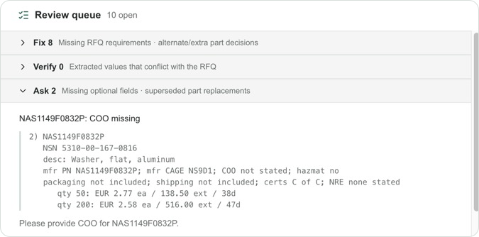
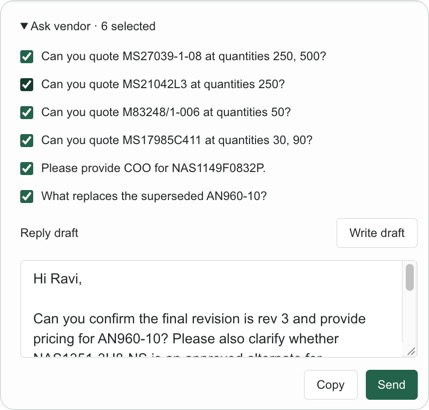

# RFQ Desk

A workspace for reviewing extracted vendor quotes alongside RFQ requests, vendor emails, and attachment text.

## The issue

Validating extracted data against the RFQ and vendor data is slow and difficult.

### Assumptions

- The biggest bottleneck is time spent verifying each vendor's quote against the RFQ request.
- RFQ submission and email services are assumed to be plugged into the broader workflow. This exercise simulates those actions locally.

- Required fields

  The following fields are assumed to be required, based on discussion with Benjamin:

  | Level             | Fields                                          |
  | ----------------- | ----------------------------------------------- |
  | Quote header      | Payment Terms, Days Quote Valid, Vendor Contact |
  | Product           | PN                                              |
  | Each quoting line | Quantity, Unit Cost, Price, Currency, Lead Time |

  Lines marked as not quoting skip required-line checks. No-bid products remain visible.

## Run

Requires Node.js 20.9 or newer and npm.

Install dependencies once after cloning and start the development server:
:

```sh
npm install
npm run dev
```

Open [localhost:3000](http://localhost:3000). No environment variables or external services are required. The dataset is bundled from `src/data/vq-data.json` at build time; user changes stay in React state.

## Feature Highlights

### Review queue

[](image.png)

The queue compares extracted quote data against the RFQ's and triage issues into three buckets. Selecting an issue highlights its evidence and auto scrolls to the relevant fields.

| Bucket     | What goes here                                                                                                                             | How to resolve it                                                                                                                                         |
| ---------- | ------------------------------------------------------------------------------------------------------------------------------------------ | --------------------------------------------------------------------------------------------------------------------------------------------------------- |
| **Fix**    | Missing required values, requested parts or quantity breaks, or an alternate/extra product awaiting a decision.                            | Correct the quote, use **Apply** for supported missing values, or accept/reject the product. Vendor questions are available for missing parts and breaks. |
| **Verify** | A populated NSN differs from the RFQ, or a quoted quantity falls outside the requested breaks.                                             | Edit the value or choose **Keep** to confirm it.                                                                                                          |
| **Ask**    | Missing optional product details (COO, Mfr CAGE, certifications, packaging, shipping, hazmat), or a superseded part needing a replacement. | Use the proposed questions to follow up with the vendor.                                                                                                  |

Only **Fix** blocks **Submit RFQ**. Verify and Ask remain non-blocking. Submission records a timestamp in the current session.

```info
Matching uses PN first: the same PN is the requested part; a different PN with the same NSN is an alternate; neither match means an extra. Rejected products stop raising issues. Rejecting an alternate adds a missing-part Fix if no other product covers the requested part. Product accept/reject decisions can be undone. Products with no quote lines are treated as no-bids and skip break and product-detail checks, except for superseded-part follow-up.
```

### Auto draft email

[](image-1.png)

Select vendor questions from **Fix** and **Ask**, click **Write draft**, then edit, copy, or send. Regenerate explicitly after changing questions or quote data. **Send** adds the message to the local thread; it does not deliver email or resolve the issues.

## What is flaky in this exercise

- **Brittle quote matching:** autofill relies on the pattern `qty (\d+): ([A-Z]{3}) ([\d.]+) ea / ([\d.]+) ext / (\d+)d`, allowing flexible whitespace. Different wording, number formats, or lead-time units can prevent matching.
- **Incomplete verification:** populated extracted values are not checked against vendor text. Required-field checks test presence, not commercial validity; an incorrect price can pass review.
- **Temporary state:** refreshing clears review work and restores the original dataset, removing sent replies. Each tab keeps its own changes in React state, so refreshing one tab does not affect another's email history. The server builds replies without storing them.

## Next steps

1. Add LLM checking to compare extracted values against the RFQ and vendor evidence, flag contradictions, validate quantities/prices/totals, and invalidate affected review decisions after edits.
2. Support adding missing products and quote lines, persist review work, make dataset reset explicit, and connect submission and email services.

## Checks

```sh
npm run lint
npm run typecheck
npm run test:review  # focused rule and action tests
npm run test:email   # draft, reply endpoint, and seed-isolation tests
npm run format:check
npm run build
```
